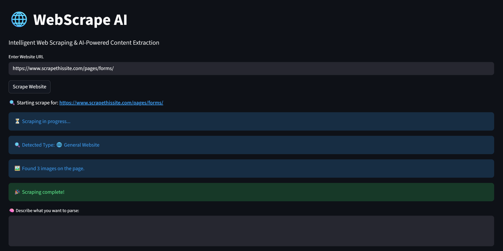
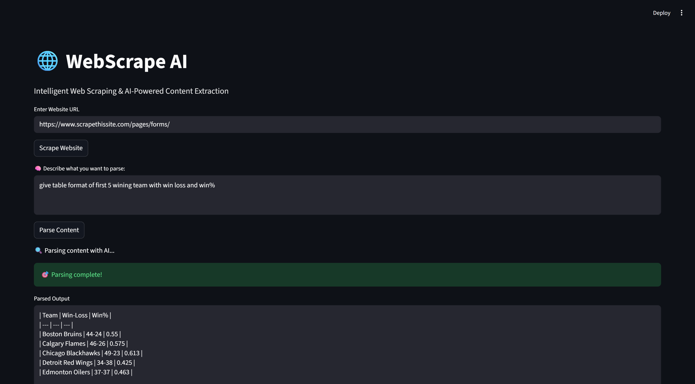

# ScrapePilot 🧠🌐
AI Powered Web Scraper | Python + Selenium + Streamlit




### Features
- AI-based (ollama3.2) DOM parsing
- Proxy + headless browser scraping
- Auto-detect website type
- Image extraction

### Install
```sh
pip install -r requirements.txt
Run
sh
Copy code
streamlit run main.py
yaml
Copy code
```

